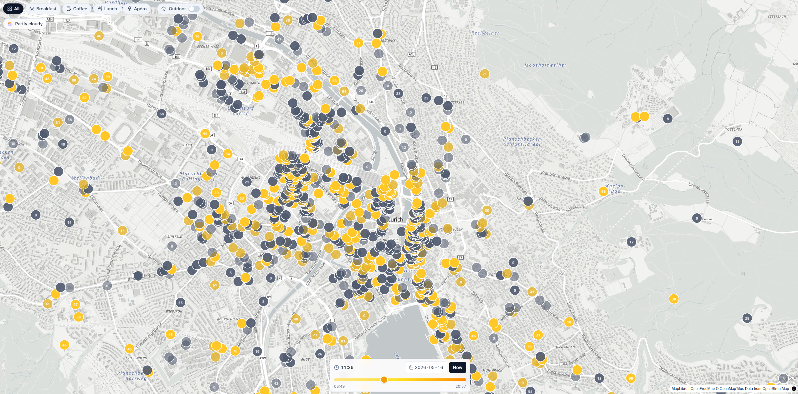

# Zürich Sunny Spots

Explore at: zuri-sunny-production.up.railway.app

A web app that shows which Zürich cafés, bars, and restaurants with outdoor seating are currently in the sun — or will be at a chosen time. POIs and building footprints come from OpenStreetMap; sun position from SunCalc; shadow occlusion is raycast in a Web Worker on the client.

Built with TanStack Start (Vite + Nitro), Drizzle + better-sqlite3, MapLibre GL + deck.gl. Deploys to Railway as a single Node process with a persistent SQLite volume.

## Local development

```bash
pnpm install
pnpm run dev
```

Open http://localhost:3000. On the very first request, the server will:

1. Apply Drizzle migrations to `./data/zurich.db`.
2. Fetch all Zürich POIs and building footprints from the public Overpass API (~30–60s, blocking on the seed not the first response — the page renders immediately, data appears once seed completes).

To clear the local DB and force a re-seed:

```bash
rm -f data/zurich.db data/zurich.db-shm data/zurich.db-wal
```

## Tests

```bash
pnpm test
```

Vitest runs the geo / sun / shadow / Overpass / opening-hours / timeline suites — 35 tests across 6 files.

## Architecture

- **Server (TanStack Start + Nitro):** server functions in `src/server/functions.ts` for `getPoisInBbox`, `getBuildingsInBbox`, `getPoiById`, `refreshData`. SQLite lives at `process.env.DB_PATH ?? ./data/zurich.db`. Seed and weekly refresh loop bootstrap on first server-function call (`src/server/init.ts`).
- **Client:** the home route fetches viewport-bounded POIs + buildings, hands them to a Web Worker (`src/workers/shadow-worker.ts`) along with the current time. The worker raycasts each POI toward the sun bearing through an rbush index of building footprints and reports back a `{ id → sunny? }` map. Marker colors update in real time as the user drags the slider.
- **URL state:** `?t=<ISO>` and `?cat=<category>` round-trip through TanStack Router search params for shareable links.

## Deploy to Railway

1. Push this repo to GitHub.
2. https://railway.com/new → "Deploy from GitHub repo" → pick this repo. Railway detects `nixpacks.toml` and builds with `pnpm install --frozen-lockfile && pnpm run build` on Node 24.
3. **Provision a volume** for the SQLite database:
   - In the service, click **Settings → Volumes → New volume**.
   - Mount path: `/data`. Pick any size; <100MB is sufficient (current data is ~50MB).
4. **Set environment variables** under the Variables tab:
   - `DB_PATH=/data/zurich.db`
5. Deploy. The first cold start runs migrations and seeds the DB from Overpass (logs print `[init] seeded N pois, M buildings` when complete).

The default `railway.json` requests 1 replica with `ON_FAILURE` restart policy and a `/` healthcheck.

## Project layout

```
src/
  routes/          file-based TanStack Router routes
  components/      SunMap, TimeSlider, FilterBar, PoiSheet, SunTimeline
  lib/             geo / sun / shadows / opening-hours / timeline / use-sun-status
  server/          functions, overpass, refresh, init, db (drizzle schema + client)
  workers/         shadow-worker (module worker)
drizzle/migrations/ generated SQL migrations
data/              local SQLite (gitignored)
```

## Tech notes

- The `opening_hours` library wraps OSM-style opening hours strings; we treat `null` / unparseable as "open".
- `better-sqlite3` ships prebuilds for Node 22/24 on Linux x64; `python3` + `build-essential` are included in the Dockerfile as a fallback for source builds.
- MapLibre's CJS named exports break Vite SSR — the map component imports `maplibregl` as default and uses a `mounted` gate so the map only initializes client-side.
- Overpass blocks Node's default user agent — `src/server/overpass.ts` sends an explicit `User-Agent`.
- `nitro-nightly` is pinned (not `@latest`) — recent 4.x nightlies broke the SSR self-fetch pattern. See `docs/prod.md`.

For the full deployment journey — what broke on Railway, why, and how it was fixed — see [`docs/prod.md`](./docs/prod.md).





For the cloud-aware sun + per-spot daily rating feature (sky chip, marker numbers, overcast desaturation), see [`docs/cloud-aware-sun.md`](./docs/cloud-aware-sun.md).
